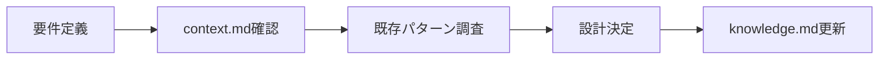
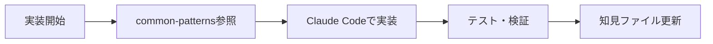
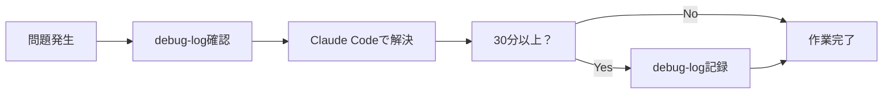

# HukuLog_T3Stack - Claude Code開発ガイド

## プロジェクト概要
**HukuLog_T3Stack**は、服とコーディネートを効率的に管理できるWebアプリケーションです。

- **技術スタック**: Next.js T3 Stack (TypeScript + tRPC + Drizzle ORM)
- **認証**: Better Auth + SimpleWebAuthn (Passkey対応)
- **データベース**: PostgreSQL
- **UI**: TailwindCSS + Radix UI
- **目標**: 直感的で使いやすい服管理・コーディネートアプリの提供

## 📚 知見管理システム

このプロジェクトでは、[Zenn記事「Claude Codeで効率的に開発するための知見管理」](https://zenn.dev/driller/articles/2a23ef94f1d603)を参考に、体系的な知見管理システムを構築しています。

### 📋 知見ファイル構成

#### `.claude/context.md` - プロジェクトコンテキスト
- プロジェクトの背景、目的、制約条件
- T3 Stack選定理由と技術的制約
- ビジネス要件とユーザーストーリー
- 技術選定の意思決定記録

#### `.claude/project-knowledge.md` - 技術知見集
- T3 Stack実装パターンや設計決定の知見
- 認証システム（Passkey）のベストプラクティス
- Drizzle ORMとtRPCの効果的な組み合わせ方
- TailwindCSS + Radix UIのコンポーネント設計
- パフォーマンス最適化の手法

#### `.claude/project-improvements.md` - 改善履歴
- 過去の試行錯誤の記録
- パフォーマンス改善の履歴
- UI/UX改善プロセスと結果
- 技術的課題の解決記録
- 技術スタック変遷の記録

#### `.claude/common-patterns.md` - 頻用パターン集
- 頻繁に使用するT3 Stackパターン
- tRPCルーターの定型実装
- Drizzleスキーマの作成パターン
- Radix UIコンポーネントのカスタマイズ
- Claude Code向けのコマンドテンプレート

#### `.claude/debug-log.md` - デバッグ記録
- 重要なデバッグ記録（30分以上要した問題）
- T3 Stack特有の問題と解決法
- Passkeyやブラウザ認証関連のトラブルシューティング
- パフォーマンス問題の解決事例
- 緊急時対応手順

### 📁 デバッグ支援ディレクトリ

```
.claude/debug/
├── sessions/     # セッション別の一時ログ
├── temp-logs/    # 作業中の一時ファイル
└── archive/      # 解決済み問題の保管
```

## 🎯 Claude Codeとの協働ルール

### 1. 開発開始前の確認
Claude Codeでの開発を始める前に、以下を必ず実行：
```bash
# 関連する知見ファイルを確認
cat .claude/context.md | head -20
cat .claude/project-knowledge.md | grep -A 5 "[実装したい機能]"
```

### 2. 実装時のルール
- **新しい実装や重要な決定**を行った際は、該当するファイルを必ず更新
- **機能実装前**に既存の知見ファイルで類似パターンを確認
- **UI/UXの変更**は必ずアクセシビリティを考慮
- **API設計**は既存のtRPCパターンに従う

### 3. 問題解決時のルール
- **解決に30分以上要した場合**は`debug-log.md`に記録
- **T3 Stack特有の問題**は詳細に記録してチーム知見とする
- **一時的な回避策**と**根本的解決策**を明確に区別

### 4. 継続的改善
- **週次レビュー**: 新しい知見の整理と記録
- **月次メンテナンス**: 古い情報の整理とアップデート
- **四半期評価**: 知見管理システム自体の改善

## 🚀 効果的なClaude Codeプロンプト例

### プロジェクト理解を促すプロンプト
```
このプロジェクトはHukuLog_T3Stackです。
.claude/context.mdのプロジェクト概要と制約条件を理解し、
.claude/project-knowledge.mdの実装パターンに従って、
[具体的な要求]を実装してください。
```

### 既存知見の活用
```
.claude/common-patterns.mdの[関連パターン]を参考に、
.claude/project-improvements.mdの過去の改善事例を考慮して、
[新機能]を設計・実装してください。
```

### デバッグ支援
```
.claude/debug-log.mdの[類似問題]の解決法を参考に、
以下のエラーを分析し、解決策を提案してください：
[エラー内容]
```

## 🔄 開発フロー

### 1. 企画・設計段階


### 2. 実装段階


### 3. 問題解決段階


## 📊 コミットルール

知見管理システムに関連するコミットは以下の形式で記録：

```bash
# 知見ファイルの更新
feat: [機能名]の実装パターンをproject-knowledge.mdに追加
docs: context.mdの制約条件を最新状況に更新
fix: debug-log.mdに[問題名]の解決法を記録

# 通常の開発
feat: [機能名]の実装
fix: [バグ修正内容]
docs: [ドキュメント更新内容]
style: [UIスタイル変更]
refactor: [リファクタリング内容]
test: [テスト追加・修正]
chore: [設定やツール変更]
```

## 🔮 将来計画

### 知見管理システムの発展
- **AI支援**: Claude Codeでの自動知見抽出・分類
- **テンプレート化**: よく使用するパターンの自動生成
- **メトリクス追跡**: 知見活用による開発効率向上の定量評価

### プロジェクト発展
Loco.rsバックエンドAPI移行計画については [Issue #2](https://github.com/UtakataKyosui/HukuLog_T3Stack/issues/2) で管理しています。

---

## 🎯 重要事項

**Claude Codeでの開発時は、必ず該当する知見ファイルを参照し、新たな学びを記録してください。**

この知見管理システムは「生きた文書」として、プロジェクトの成長と共に継続的に進化していきます。効率的な開発と高品質なコードベースの維持のため、積極的に活用・更新していきましょう。

---

**システム導入日**: 2025-06-21  
**参考記事**: [Claude Codeで効率的に開発するための知見管理](https://zenn.dev/driller/articles/2a23ef94f1d603)  
**最終更新**: 2025-06-21

## 機能テストに関する覚書
- すでにさまざまな機能が搭載されている機能の詳細な調査とPlaywrightによる機能テストの実装が必要
- 機能テストはプロジェクトの品質保証と安定性確保のために重要
- Playwrightを使用し、アプリケーションの主要機能を網羅的にテストする方針
- アプリケーションの既存機能の包括的な機能テストをPlaywrightで実装し、システムの信頼性を高める